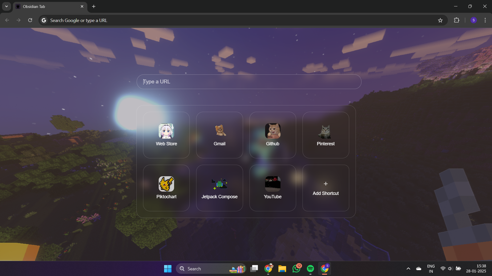
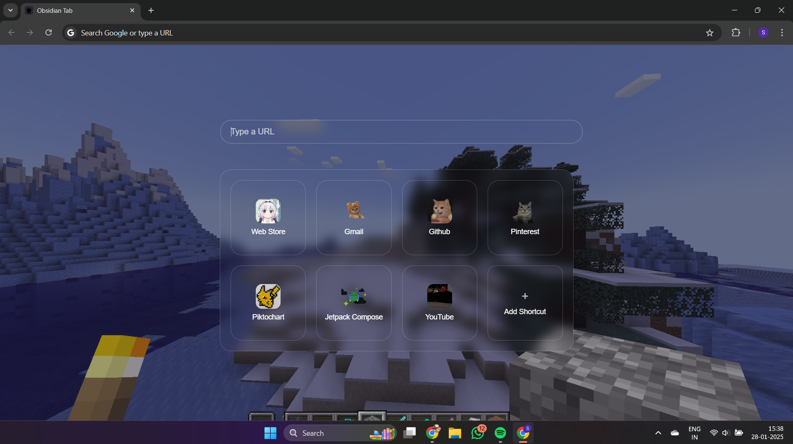

# 🌟 Prisma - Dynamic Minecraft Wallpapers

<em>Transform your new tab page with stunning Minecraft wallpapers</em>

## ✨ Features

- 🖼️ **Dynamic Wallpapers**: Fresh Minecraft landscapes on every new tab
- 📌 **Custom Shortcuts**: Organize your favorite websites with style
- 🎮 **Minecraft-Inspired Design**: Beautiful purple accents and blur effects
- 🔄 **Drag & Drop**: Easily rearrange your shortcuts
- 💜 **Offline Support**: Elegant purple theme when offline
- ⚡ **Fast & Lightweight**: Zero impact on browser performance
  

## 🛠️ Installation

1. Visit [Chrome Web Store](https://chromewebstore.google.com/detail/prisma-classy-minecraft-w/ncidcddjmndmgdpjepghgpbleakdmnbp)
2. Click "Add to Chrome"
3. Enjoy your new beautiful new tab experience!
  

## 🖼️ Screenshots

  
  

 

## 🤝 Contributing

1. Fork the repository
2. Create your feature branch (`git checkout -b feature/amazing-feature`)
3. Commit your changes (`git commit -m 'Add some amazing feature'`)
4. Push to the branch (`git push origin feature/amazing-feature`)
5. Open a Pull Request
  

## 🔒 Privacy
- No data collection
- No analytics
- No external dependencies
- Only required permissions
- Open source code
  

### Psst.. You can star this repo

## Contact Me

